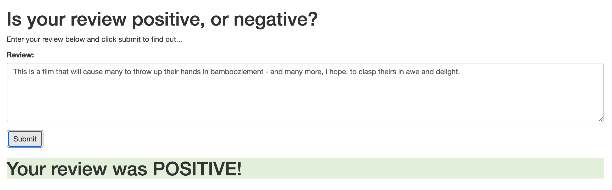

# Deployment of a Sentiment Analysis Model

This project was completed as part of Udacity's Machine Learning NanoDegree program.

## Project Goal

Using SageMaker, the goal of this project is to build a simple web page where the user can submit a review. The web page will then send the review to a deployed machine learning model which will predict the sentiment (postivie or negative) of the review. The model uses PyTorch and is training on a dataset from IMDB.

## Key Steps

1. Download or otherwise retrieve the data.
2. Process / Prepare the data.
3. Upload the processed data to S3.
4. Train a chosen model.
5. Test the trained model (typically using a batch transform job).
6. Deploy the trained model.
7. Use the deployed model.

## Example output

## Contact

* If you have any questions, you can contact me at nzamersi@gmail.com